# Gold Guard - Tower Defense - Gruppe 10

Gold Guard ist ein spannendes Tower Defense-Spiel, das mit Unity und C# entwickelt wurde. In diesem Spiel musst du deine
**Schatztruhe vor feindlichen Piratenschiffen schützen**, die versuchen, dein wertvolles Gold zu plündern. Platziere
strategisch **Waffen** entlang des Flusses, um die Piratenschiffe zu zerstören und dein Gold zu verteidigen. Das Spiel
besteht aus **10 Wellen**, die alle erfolgreich bestreiten werden müssen, um das Spiel zu gewinnen.

## Spielziel

Das Ziel des Spiels ist es, alle Piratenschiffe daran zu hindern, deine Schatztruhe zu erreichen und das Gold zu
stehlen. Jede Welle wird schwieriger, da die Piratenschiffe schneller und widerstandsfähiger werden. Deine Aufgabe ist
es, deine Waffen strategisch zu platzieren und Upgrades zu kaufen, um den Angriffen der Piraten standzuhalten. Zudem
kannst du strategisch deine Waffen verkaufen, um stärkere Waffen nach zu kaufen.

## Spielablauf

1. **Startbildschirm**: Der Spieler wird mit einem Startbildschirm begrüßt, auf dem er das Spiel starten oder
   Anleitungen erhalten kann.

2. **Vorbereitung**: Vor Beginn jeder Welle und auch während der verschiedenen Wellen, hat der Spieler die Möglichkeit,
   seine Waffen zu kaufen und zu platzieren. Der Spieler verwendet das Gold aus der Schatztruhe, um verschiedene Waffen
   zu erwerben. Jede Waffe hat unterschiedliche Kosten und Fähigkeiten.

3. **Kampf**: Sobald die Welle gestartet ist, beginnen die feindlichen Piratenschiffe entlang des Flusses zu spawnen und
   sich auf die Schatztruhe zuzubewegen. Der Spieler muss seine Waffen effektiv einsetzen, um die Schiffe zu zerstören,
   bevor sie die Schatztruhe erreichen. Der Spieler Upgrades für seine Waffen kaufen, um ihre Leistung zu verbessern.

4. **Belohnungen**: Für jedes zerstörte Piratenschiff erhält der Spieler zusätzliches Gold. Der Spieler kann dieses Gold
   verwenden, um in der laufenden Welle weitere Waffen oder Upgrades zu kaufen.

5. **Wellenabschluss**: Die Welle endet, wenn alle Piratenschiffe zerstört wurden oder wenn 5 Piratenschiffe die
   Schatztruhe erreicht haben. Wenn der Spieler alle Wellen erfolgreich abgeschlossen hat, gewinnt er das Spiel.

6. **Game Over**: Wenn 5 Pirateschiffe die Schatztruhe erreicht haben, und der Spieler alle seine Leben verloren hat,
   endet das Spiel. Der Score der Runde wird dann im Game Over Screen angezeigt.

## Shop und Waffen

Im Shop gibt es **4 verschiedene Waffen** die man kaufen kann. Es gibt **3 Kanonen** die unterschiedliche Eigenschaften
und Kosten haben, die auf Feldern um den Fluss platziert werden können. Zudem gibt es noch eine **Krake** die man im Wasser
platzieren kann und feindliche Schiffe aufhalten soll. Die Waffen können während des Spiels **geupgraded** und 
**verkauft** werden.

### **Basic Kanone**

| Level | Sprite                                                                     | Kosten (Gold) | Reichweite (Tiles) | Schüsse/Sekunde | Schaden |
|-------|----------------------------------------------------------------------------|---------------|--------------------|-----------------|---------|
| 1     | 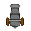        | 50            | 5                  | 2               | 2,5     |
| 2     | 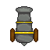 | 75            | 5,5                | 2               | 5       |
| 3     | 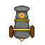 | 100           | 6                  | 2               | 7,5     |

### **Schwere Kanone**

| Level | Sprite                                                                       | Kosten (Gold) | Reichweite (Tiles) | Schüsse/Sekunde | Schaden |
|-------|------------------------------------------------------------------------------|---------------|--------------------|-----------------|---------|
| 1     | 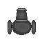        | 125           | 4,5                | 0,5             | 15      |
| 2     | 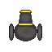 | 175           | 5                  | 0,75            | 20      |
| 3     | 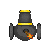 | 250           | 5,5                | 1               | 25      |

### **Lange Kanone**

| Level | Sprite                                                                     | Kosten (Gold) | Reichweite (Tiles) | Schüsse/Sekunde | Schaden |
|-------|----------------------------------------------------------------------------|---------------|--------------------|-----------------|---------|
| 1     | 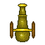        | 75            | 8                  | 0,75            | 7,5     |
| 2     | 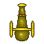 | 100           | 9                  | 1               | 10      |
| 3     | 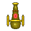 | 150           | 10                 | 1,25            | 12,5    |

### **Krake**

| Level | Sprite                                            | Kosten (Gold) | Reichweite (Tiles) | Schüsse/Sekunde | Schaden                     |
|-------|---------------------------------------------------|---------------|--------------------|-----------------|-----------------------------|
| 1     |  | 50            | 1                  | -               | 30% des gegnerischen Lebens |

## Upgrades

Für die Kanonen können **jeweils 2 Upgrades** gekauft werden (also **insgesamt 3 Level**), die die Reichweite, den
angerichteten Schaden und die Schussgeschwindigkeit erhöht.

## Gegnerische Schiffe

In jeder Welle spwanen unterschiedlich viele Schiffe die verschiedene Eigenschaften haben. Je höher desto mehr Schiffe
spawnen, um deine Schatztruhe zu plündern.

### **Normales Schiff**

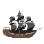  
> Durchschnittliche Geschwindigkeit & Leben

### **Schnelles Schiff**

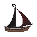
> Hohe Geschwindigkeit, dafür aber weniger Leben

### **Starkes Schiff**

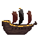
> Niedrige Geschwindigkeit, dafür aber viel Leben

## Steuerung

Die Steuerung des Spiels erfolgt über die Maus:

- Der Spieler kann mit der Maus Waffen kaufen, platzieren und Upgrades
  durchführen.

## Gameplay

Um das Spiel zu spielen, muss folgendes Schritte getan werden:

- Spieler können das Spiel im Webbrowser spielen, indem sie die URL zum Host des Spiels aufrufen.

## Mitwirkende

- Thomas Meaney
- Stephan Hefele
- Mihnea-Andrei Stefanescu
- Petra Murr Yana
- Maximilian Kriebel

Vielen Dank für das Spielen von Gold Guard Tower Defense! Wir hoffen, Sie haben viel Spaß beim Verteidigen Ihrer
Schatztruhe vor den Piraten!
